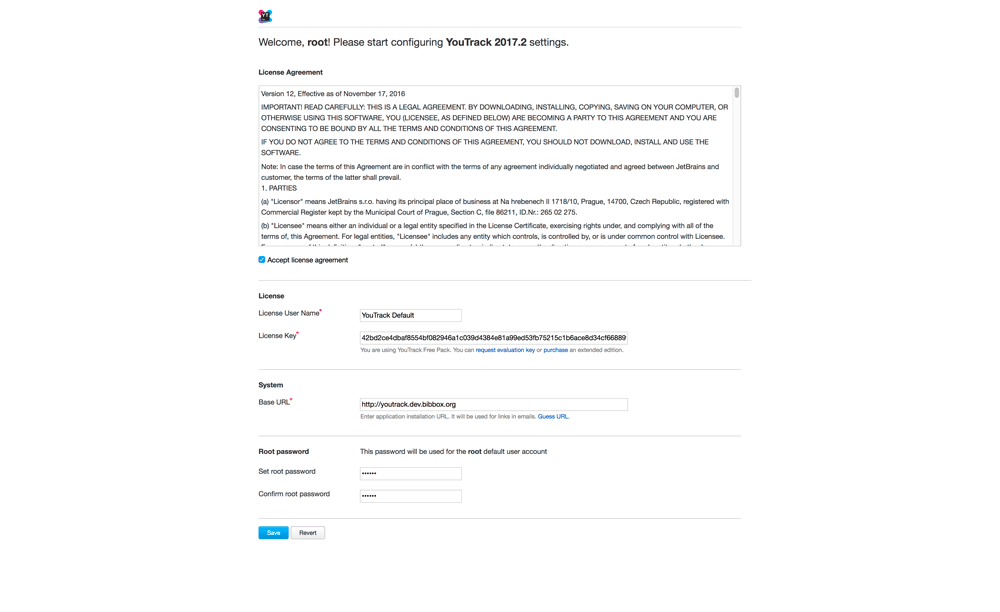
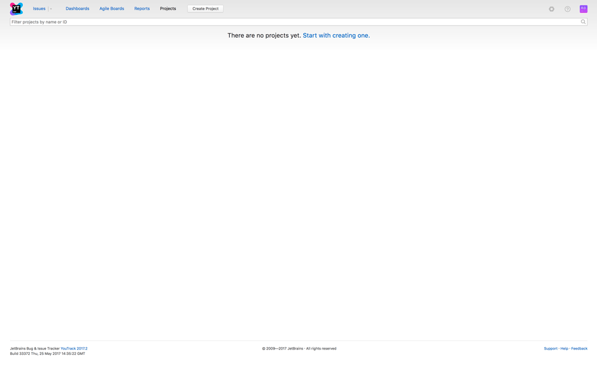

## YouTrack Installation Instructions 

* Install the YouTrack application from the BIBBOX store and wait for the logs to stop moving.

* Open up the application by clicking the application tile header in the Applications menu, or the dashboard/logs view.

* If BIBBOX finished the installation of YouTrack in the system, you will see the first setup screen. Here, you have to accept the **license agreement** and set a **Root password**. When you are done, you can click the blue **Save** button to finish the setup process.

    
    
* That's it! YouTrack is now fully set up and ready to manage your agile projects!

    

## After the installation

Have a nice ride with the new Admins youngtimer.

